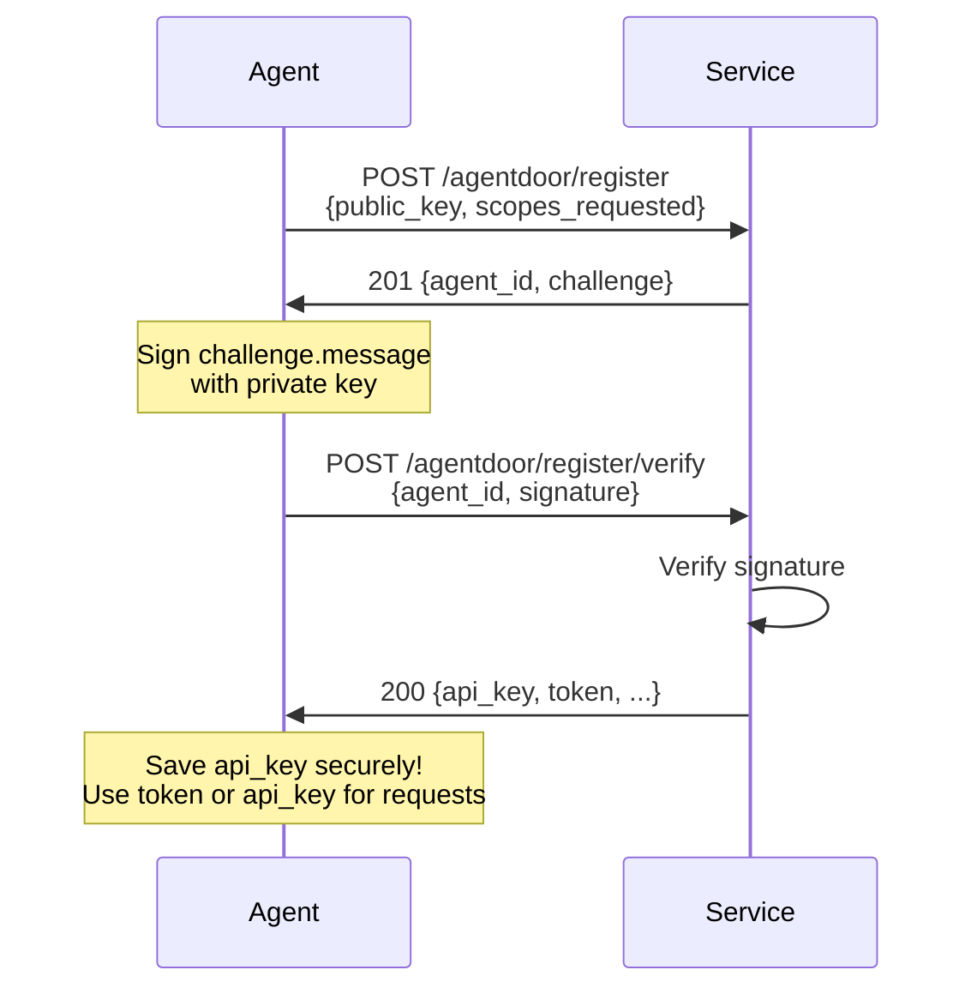

Agent registration is a two-step challenge-response flow that proves ownership of a cryptographic key pair. This ensures agents cannot impersonate each other.

## Step 1: Initiate Registration

### Endpoint

```
POST /agentdoor/register
```

### Request Body

<ParamField body="public_key" type="string" required>
  Base64-encoded Ed25519 public key (32 bytes). This becomes the agent's permanent identity.
</ParamField>

<ParamField body="scopes_requested" type="string[]" required>
  Array of scope IDs the agent wants access to. Must be non-empty and contain only valid scope IDs from the discovery document.
</ParamField>

<ParamField body="x402_wallet" type="string">
  Optional blockchain wallet address for x402 payments (required if service uses x402)
</ParamField>

<ParamField body="metadata" type="object">
  Optional metadata about the agent
  
  <Expandable title="common metadata fields">
    - `framework`: Agent framework name (e.g., `"langchain"`, `"crewai"`)
    - `framework_version`: Framework version
    - `name`: Human-readable agent name
    - `description`: Agent description
    - `developer_id`: Developer or organization identifier
  </Expandable>
</ParamField>

### Response (201 Created)

<ResponseField name="agent_id" type="string" required>
  Newly assigned agent ID (format: `ag_*`). Save this - you'll need it for verification.
</ResponseField>

<ResponseField name="challenge" type="object" required>
  Challenge that must be signed to complete registration
  
  <Expandable title="challenge properties">
    <ResponseField name="nonce" type="string" required>
      Base64-encoded random nonce (32 bytes)
    </ResponseField>
    
    <ResponseField name="message" type="string" required>
      Full message to sign. Format: `agentdoor:register:{agent_id}:{timestamp}:{nonce}`
    </ResponseField>
    
    <ResponseField name="expires_at" type="string" required>
      ISO 8601 timestamp when this challenge expires (default: 5 minutes from creation)
    </ResponseField>
  </Expandable>
</ResponseField>

### Example Request

```bash
curl -X POST https://api.example.com/agentdoor/register \
  -H "Content-Type: application/json" \
  -d '{
    "public_key": "cXVpY2sgYnJvd24gZm94IGp1bXBzIG92ZXIgdGhlIGxhenk=",
    "scopes_requested": ["weather.read", "forecast.read"],
    "metadata": {
      "framework": "langchain",
      "framework_version": "0.1.0",
      "name": "Weather Assistant"
    }
  }'
```

### Example Response

```json
{
  "agent_id": "ag_V1StGXR8_Z5jdHi6B",
  "challenge": {
    "nonce": "abc123...",
    "message": "agentdoor:register:ag_V1StGXR8_Z5jdHi6B:1704067200:abc123...",
    "expires_at": "2024-01-01T00:10:00.000Z"
  }
}
```

### Error Responses

<ResponseField name="400 - invalid_request">
  Missing or invalid required fields (public_key, scopes_requested)
</ResponseField>

<ResponseField name="400 - invalid_scopes">
  One or more requested scopes are not available. Response includes `available_scopes` array.
</ResponseField>

<ResponseField name="409 - already_registered">
  An agent with this public key already exists. Response includes the existing `agent_id`.
</ResponseField>

<ResponseField name="429 - rate_limit_exceeded">
  Registration rate limit exceeded. Check `retry_after` in response.
</ResponseField>

---

## Step 2: Verify Signature

### Endpoint

```
POST /agentdoor/register/verify
```

After receiving the challenge, the agent must:
1. Sign the `challenge.message` string with their Ed25519 private key
2. Base64-encode the signature (64 bytes)
3. Submit the signature for verification

### Request Body

<ParamField body="agent_id" type="string" required>
  The agent_id returned from step 1
</ParamField>

<ParamField body="signature" type="string" required>
  Base64-encoded Ed25519 signature of the challenge message (64 bytes)
</ParamField>

### Response (200 OK)

<ResponseField name="agent_id" type="string" required>
  The agent's ID
</ResponseField>

<ResponseField name="api_key" type="string" required>
  API key for authentication (format: `agk_live_*` or `agk_test_*`). **This is only returned once - save it securely!**
</ResponseField>

<ResponseField name="scopes_granted" type="string[]" required>
  Array of scopes granted to this agent (may differ from requested scopes)
</ResponseField>

<ResponseField name="token" type="string" required>
  JWT token for immediate use
</ResponseField>

<ResponseField name="token_expires_at" type="string" required>
  ISO 8601 timestamp when the token expires
</ResponseField>

<ResponseField name="rate_limit" type="object" required>
  Rate limit configuration for this agent
  
  <Expandable title="rate_limit properties">
    <ResponseField name="requests" type="number" required>
      Maximum number of requests allowed
    </ResponseField>
    
    <ResponseField name="window" type="string" required>
      Time window for rate limit (e.g., `"1h"`, `"1d"`)
    </ResponseField>
  </Expandable>
</ResponseField>

<ResponseField name="x402" type="object">
  x402 payment information (only present when x402 is enabled)
  
  <Expandable title="x402 properties">
    <ResponseField name="payment_address" type="string" required>
      Service owner's wallet address for payments
    </ResponseField>
    
    <ResponseField name="network" type="string" required>
      Blockchain network (e.g., `"base"`, `"solana"`)
    </ResponseField>
    
    <ResponseField name="currency" type="string" required>
      Payment currency (e.g., `"USDC"`)
    </ResponseField>
  </Expandable>
</ResponseField>

### Example Request

```bash
curl -X POST https://api.example.com/agentdoor/register/verify \
  -H "Content-Type: application/json" \
  -d '{
    "agent_id": "ag_V1StGXR8_Z5jdHi6B",
    "signature": "dGhlIHF1aWNrIGJyb3duIGZveCBqdW1wcyBvdmVyIHRoZSBsYXp5IGRvZw=="
  }'
```

### Example Response

```json
{
  "agent_id": "ag_V1StGXR8_Z5jdHi6B",
  "api_key": "agk_live_abc123...",
  "scopes_granted": ["weather.read", "forecast.read"],
  "token": "eyJhbGciOiJIUzI1NiIsInR5cCI6IkpXVCJ9...",
  "token_expires_at": "2024-01-01T01:00:00.000Z",
  "rate_limit": {
    "requests": 1000,
    "window": "1h"
  },
  "x402": {
    "payment_address": "0x742d35Cc6634C0532925a3b844Bc9e7595f0bEb",
    "network": "base",
    "currency": "USDC"
  }
}
```

### Error Responses

<ResponseField name="400 - invalid_request">
  Missing or invalid agent_id or signature
</ResponseField>

<ResponseField name="400 - invalid_signature">
  Signature verification failed. Ensure you signed the exact challenge message with the correct private key.
</ResponseField>

<ResponseField name="404 - not_found">
  No pending registration found for this agent_id. The challenge may have expired.
</ResponseField>

<ResponseField name="410 - challenge_expired">
  The registration challenge has expired. Start over at step 1.
</ResponseField>

---

## Complete Registration Flow



## Challenge Message Format

The challenge message follows this exact format:

```
agentdoor:register:{agent_id}:{timestamp}:{nonce}
```

- **Prefix**: Always `agentdoor:register`
- **Agent ID**: The ID assigned in step 1
- **Timestamp**: Unix timestamp in seconds when the challenge was created
- **Nonce**: Base64-encoded random nonce for uniqueness

Example:
```
agentdoor:register:ag_V1StGXR8_Z5jdHi6B:1704067200:abc123...
```

<Warning>
  Sign the **exact** challenge message string byte-for-byte. Any modification will cause verification to fail.
</Warning>

## Security Considerations

1. **Challenge Expiry**: Challenges expire after 5 minutes by default to prevent replay attacks
2. **One-time Use**: Each challenge can only be verified once
3. **Rate Limiting**: Registration endpoint is rate-limited (typically 10 requests/hour per IP)
4. **Public Key Uniqueness**: Each public key can only register once
5. **API Key Security**: The API key is only shown once - store it securely

## Next Steps

After successful registration:

1. **Save Credentials**: Store both the API key and JWT token securely
2. **Start Making Requests**: Use either token for authentication
3. **Refresh Tokens**: When JWT expires, use the [authentication endpoint](/api/authentication) to get a new one
