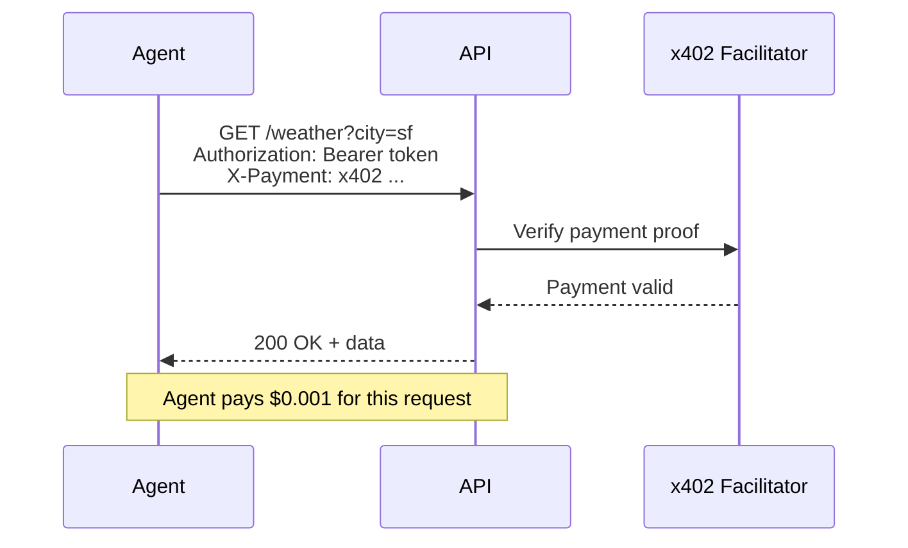

AgentDoor integrates with the **x402 payment protocol** to enable AI agents to pay for API access programmatically. Agents can attach micropayments to individual requests, enabling usage-based pricing without manual billing.

## What is x402?

x402 is a protocol for **HTTP-native micropayments**. It extends HTTP with payment headers, allowing clients to pay for API requests in real-time using blockchain transactions.

**Key features:**
- **Per-request payments** - Agents pay only for what they use
- **Blockchain-native** - Payments on Base, Solana, or other networks
- **Stablecoin support** - USDC, USDT, SOL, etc.
- **No accounts required** - Agents authenticate via wallet signatures
- **Sub-cent pricing** - Support for $0.001/request and below

**Learn more:** [x402.org](https://x402.org)

## How It Works

### Payment Flow



### Request with Payment

```typescript
// Agent makes a paid request
const response = await fetch('https://api.example.com/weather/forecast?city=sf', {
  headers: {
    'Authorization': 'Bearer agk_live_...',
    'X-Payment': 'x402 base:USDC:0.001:0x1234...signature'
  }
});

const data = await response.json();
// Agent paid $0.001 for this request
```

**Payment header format:**

```
X-Payment: x402 {network}:{currency}:{amount}:{signature}
```

Example:
```
X-Payment: x402 base:USDC:0.001:0x742d35Cc6634C0532925a3b844Bc9e7595f0bEb...
```

## Enabling x402 in AgentDoor

### Configuration

Add x402 config to your AgentDoor setup:

```javascript
const agentdoor = require('@agentdoor/express');

app.use(agentdoor({
  scopes: [
    { 
      id: 'weather.read', 
      description: 'Read weather data',
      price: '$0.001/req'  // Per-request pricing
    },
    {
      id: 'weather.write',
      description: 'Submit weather observations',
      price: '$0.01/req'
    }
  ],
  
  // x402 payment configuration
  x402: {
    network: 'base',                    // Blockchain network
    currency: 'USDC',                   // Payment currency
    paymentAddress: '0xYourWallet...',  // Your wallet address
    facilitator: 'https://x402.org/facilitator'  // Optional: custom facilitator
  }
}));
```

**Configuration options:**

<ParamField path="x402.network" type="string" required>
  Blockchain network. Supported: `"base"`, `"solana"`, `"ethereum"`, `"polygon"`
</ParamField>

<ParamField path="x402.currency" type="string" required>
  Payment currency. Examples: `"USDC"`, `"USDT"`, `"SOL"`, `"ETH"`
</ParamField>

<ParamField path="x402.paymentAddress" type="string" required>
  Your wallet address for receiving payments.
  
  Example: `"0x742d35Cc6634C0532925a3b844Bc9e7595f0bEb"`
</ParamField>

<ParamField path="x402.facilitator" type="string">
  x402 facilitator URL. Defaults to `https://x402.org/facilitator`.
  
  Facilitators verify payment proofs and handle blockchain interactions.
</ParamField>

### Type Definition

```typescript
interface X402Config {
  network: 'base' | 'solana' | string;  // Blockchain network
  currency: 'USDC' | string;            // Payment currency
  paymentAddress: string;               // Your wallet address
  facilitator?: string;                 // Facilitator URL (optional)
}
```

## Discovery Document Integration

When x402 is configured, AgentDoor automatically includes payment info in the discovery document:

```json
{
  "agentdoor_version": "1.0",
  "service_name": "Weather API",
  "scopes_available": [
    {
      "id": "weather.read",
      "description": "Read weather data",
      "price": "$0.001/req",
      "rate_limit": "1000/hour"
    }
  ],
  "payment": {
    "protocol": "x402",
    "version": "2.0",
    "networks": ["base"],
    "currency": ["USDC"],
    "facilitator": "https://x402.org/facilitator",
    "deferred": false
  }
}
```

Agents automatically detect payment requirements and configure wallets accordingly.

## Agent-Side Payment

Agents using the AgentDoor SDK automatically handle x402 payments:

```typescript
import { AgentDoor } from '@agentdoor/sdk';

const agent = new AgentDoor({
  keyPath: '~/.agentdoor/keys.json',
  x402Wallet: '0x742d35Cc6634C0532925a3b844Bc9e7595f0bEb'  // Agent's wallet
});

// Connect to service (discovers payment requirements)
const session = await agent.connect('https://api.example.com');

// Make paid request (payment attached automatically)
const data = await session.get('/weather/forecast', {
  params: { city: 'sf' },
  x402: true  // Enable payment for this request
});

// SDK signs and attaches X-Payment header automatically
```

### Manual Payment Header

For custom implementations:

```typescript
import { buildSignedPaymentHeader } from '@agentdoor/sdk';

const paymentHeader = await buildSignedPaymentHeader({
  network: 'base',
  currency: 'USDC',
  amount: 0.001,
  recipient: '0xYourWallet...',
  wallet: {
    address: '0x1234...',
    sign: async (message: string) => {
      // Sign with wallet private key
      return signMessage(message, agentWalletPrivateKey);
    }
  }
});

const response = await fetch('https://api.example.com/weather/forecast', {
  headers: {
    'Authorization': 'Bearer agk_live_...',
    'X-Payment': paymentHeader  // "x402 base:USDC:0.001:0x..."
  }
});
```

## Server-Side Payment Verification

AgentDoor middleware automatically verifies x402 payments:

```javascript
app.get('/api/weather/forecast', (req, res) => {
  // Payment already verified by middleware
  if (req.payment) {
    console.log('Payment received:', {
      amount: req.payment.amount,      // 0.001
      currency: req.payment.currency,  // "USDC"
      network: req.payment.network,    // "base"
      txHash: req.payment.txHash       // Blockchain transaction hash
    });
  }
  
  res.json({ forecast: 'sunny' });
});
```

**Payment context:**

```typescript
interface PaymentContext {
  amount: number;         // Payment amount (e.g., 0.001)
  currency: string;       // Currency code (e.g., "USDC")
  network: string;        // Blockchain network (e.g., "base")
  txHash: string;         // Transaction hash
  sender: string;         // Sender wallet address
  recipient: string;      // Your wallet address
  timestamp: number;      // Payment timestamp
  verified: boolean;      // Whether payment was verified
}
```

## Pricing Models

### Per-Request Pricing

Charge a fixed amount per API call:

```javascript
scopes: [
  {
    id: 'weather.read',
    description: 'Read current weather',
    price: '$0.001/req'  // $0.001 per request
  }
]
```

### Tiered Pricing

Different prices for different scopes:

```javascript
scopes: [
  {
    id: 'data.basic',
    description: 'Basic data access',
    price: '$0.001/req'
  },
  {
    id: 'data.premium',
    description: 'Premium data with real-time updates',
    price: '$0.01/req'  // 10x more for premium
  },
  {
    id: 'compute.intensive',
    description: 'Run ML inference',
    price: '$0.50/req'  // Higher price for compute
  }
]
```

### Monthly Subscriptions

Charge a flat monthly rate:

```javascript
scopes: [
  {
    id: 'unlimited',
    description: 'Unlimited access for one month',
    price: '$10/month'
  }
]
```

### Dynamic Pricing

Compute price based on request parameters:

```javascript
app.use(agentdoor({
  scopes: [{ id: 'compute', description: 'ML inference' }],
  x402: {
    network: 'base',
    currency: 'USDC',
    paymentAddress: '0x...',
    // Custom pricing function
    computePrice: (req) => {
      const model = req.query.model;
      const tokens = parseInt(req.query.tokens || '100');
      
      // Price scales with token count
      const basePrice = model === 'gpt-4' ? 0.03 : 0.01;  // per 1K tokens
      return (tokens / 1000) * basePrice;
    }
  }
}));
```

## Payment Tracking

AgentDoor automatically tracks payments per agent:

```typescript
// Get agent's payment history
const agent = await storage.getAgent(agent_id);

console.log('Total paid:', agent.totalX402Paid);  // e.g., 1.234 USDC
console.log('Total requests:', agent.totalRequests);  // e.g., 1234 requests

const avgCost = agent.totalX402Paid / agent.totalRequests;
console.log('Average cost per request:', avgCost);  // e.g., $0.001
```

**Agent record:**

```typescript
interface Agent {
  id: string;
  publicKey: string;
  x402Wallet?: string;        // Agent's wallet address
  scopesGranted: string[];
  totalRequests: number;      // Total API calls
  totalX402Paid: number;      // Total amount paid (in currency)
  // ...
}
```

## Stripe Integration

Reconcile x402 payments with Stripe invoices using the `@agentdoor/stripe` package:

```typescript
import { reconcileX402WithStripe } from '@agentdoor/stripe';

// Aggregate x402 payments and create Stripe invoices
await reconcileX402WithStripe({
  agentdoorConfig,
  stripeSecretKey: process.env.STRIPE_SECRET_KEY,
  billingPeriod: 'monthly',  // or 'weekly', 'daily'
  onInvoiceCreated: (invoice) => {
    console.log('Created Stripe invoice:', invoice.id);
  }
});
```

This creates a Stripe invoice for each agent based on their x402 usage, enabling traditional billing workflows alongside crypto payments.

## x402 Bazaar Integration

List your service on the [x402 Bazaar](https://bazaar.x402.org) marketplace:

```javascript
import { registerWithBazaar } from '@agentdoor/bazaar';

await registerWithBazaar({
  agentdoorConfig,
  category: 'weather',
  tags: ['weather', 'forecast', 'real-time'],
  featured: true
});
```

Agents can discover your service through the Bazaar and connect automatically.

## x402 Wallet as Identity

Agents can use their x402 wallet as both payment source **and** authentication identity:

```typescript
// Agent registers with wallet address
const registration = await fetch('/agentdoor/register', {
  method: 'POST',
  body: JSON.stringify({
    public_key: keypair.publicKey,
    x402_wallet: '0x742d35Cc6634C0532925a3b844Bc9e7595f0bEb',  // Wallet = identity
    scopes_requested: ['weather.read']
  })
});

// Server stores wallet address
// Future payments verified against registered wallet
```

**Benefits:**
- Single identity for auth + payments
- Wallet signature = auth signature (secp256k1)
- Payment history tied to agent identity

## Security Considerations

<Warning>
**Payment verification is critical.** Always verify payments server-side before serving data.
</Warning>

### Payment Verification Checklist

- [ ] **Verify signature** - Ensure payment was signed by the claimed sender
- [ ] **Check amount** - Verify payment meets the required price
- [ ] **Validate recipient** - Ensure payment is addressed to your wallet
- [ ] **Check timestamp** - Reject old payments (prevent replay attacks)
- [ ] **Query blockchain** - For high-value requests, verify on-chain

### Handling Failed Payments

```javascript
app.use(agentdoor({
  x402: { /* ... */ },
  onPaymentFailed: (req, error) => {
    console.error('Payment verification failed:', error.message);
    
    // Log the attempt
    await logFailedPayment({
      agentId: req.agent.id,
      amount: req.headers['x-payment'],
      error: error.message,
      timestamp: new Date()
    });
    
    // Return 402 Payment Required
    return {
      status: 402,
      body: {
        error: 'payment_required',
        message: 'Payment verification failed',
        required_amount: 0.001,
        currency: 'USDC',
        network: 'base'
      }
    };
  }
}));
```

### Rate Limiting with Payments

Combine x402 payments with rate limits:

```javascript
app.use(agentdoor({
  scopes: [{ id: 'data.read', description: 'Read', price: '$0.001/req' }],
  rateLimit: {
    requests: 1000,    // Max requests per window
    window: '1h'
  },
  x402: { /* ... */ },
  // Allow paying agents to exceed rate limits
  rateLimitExempt: (req) => {
    return req.payment && req.payment.verified;
  }
}));
```

## Next Steps

<CardGroup cols={2}>
  <Card title="How It Works" icon="book-open" href="/concepts/how-it-works">
    Understand the complete AgentDoor architecture
  </Card>
  <Card title="Authentication" icon="key" href="/concepts/authentication">
    Deep dive into Ed25519 challenge-response
  </Card>
</CardGroup>